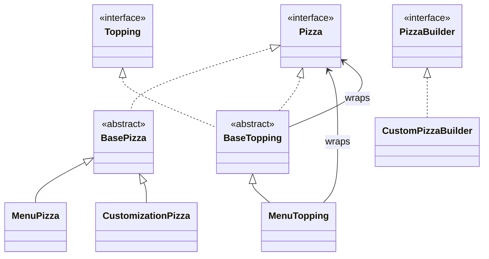
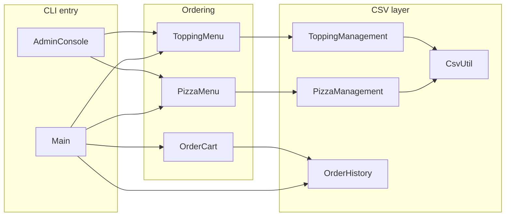

**PizzaHot Palace User Guide**  

### Welcome to PizzaHot Palace! 🍕

This is a simple pizza ordering system you can use from your computer.

---

### How to Start the System

1. Open your computer's **Terminal** or **Command Prompt**
2. Go to the folder that contains all the pizza files
3. Type these two commands one by one:

```bash
javac *.java
java Main
```

The program will start and show a welcome message.

---

### Choosing Your Mode

When the program starts, you will see:

```
Please select mode:
  1. Customer
  2. Admin
```

**Type `1`** and press Enter → You are now in **Customer Mode**

---

### Main Menu (Ordering Pizzas)

You will see the pizza menu with page numbers.

**To choose a pizza:**
- Type the **number** next to the pizza you want (example: `1` for Margherita)
- Press Enter

**Other options on the menu:**
- `c` → Make your own **Custom Pizza**
- `n` → Next page
- `p` → Previous page
- `v` → View past orders
- `x` → Exit the program

---

### Making a Custom Pizza (Build Your Own)

1. Type `c` on the main menu
2. You will see the **Toppings Menu**
3. Type the number of the topping you want to add
4. You can add as many toppings as you like
5. After adding toppings, type `d` for **Done**
6. Or type `r` to **Reset** (clear all toppings)
7. Type `e` to **Exit** without saving

The system will show you the current total price as you add toppings.

---

### After Choosing a Pizza

After you select a pizza (or finish a custom one):

- You will see your **Order Cart**
- The system asks: **What would you like to do next?**

Options:
- `1` → Order **another pizza**
- `2` → View your cart again
- `3` → **Checkout** (finish your order)
- `4` → Cancel the whole order

---

### Finishing Your Order (Checkout)

1. Choose `3` to checkout
2. You will see a nice **receipt** with:
   - Your order number
   - All the pizzas you ordered
   - The total price
3. Your order is saved automatically

---

### Viewing Past Orders

At any time on the main menu, type `v` to see previous orders.

You can browse through old orders using:
- `n` → next page
- `p` → previous page
- Type a page number to jump
- `q` → go back

---

### Simple Tips

- Always press **Enter** after typing your choice
- The system will guide you step by step
- You can add multiple pizzas to one order
- Custom pizzas start at **$10.99** + toppings
- All prices are shown clearly with `$`

---

### Example Flow (Quick Summary)

1. Start → Choose **1** (Customer)
2. See menu → Type pizza number or `c` for custom
3. For custom: add toppings → type `d` when finished
4. See cart → Choose `1` to add more or `3` to checkout
5. See receipt → Order complete!

---

**That's it!**  
Very easy — just follow the on-screen instructions.

Enjoy your pizza! 🍕

---

**Note for Admin (Optional)**  
If you are the shop owner and want to manage the menu:
- At the very beginning, choose **2** (Admin)
- You can add, update, or delete pizzas and toppings

But normal customers should always choose **1**.

---

# PizzaHot Palace (CS3343)

CLI pizza ordering system with a customer flow, optional admin panel, CSV-backed menus, and order history. All sources live in the default package (flat layout).

## Build and run

From the project root (where the `.java` and `.csv` files are):

```bash
javac *.java
java Main
```

Optional pricing checks:

```bash
java -ea PizzaPricingTest
```

## Data files

| File | Role |
|------|------|
| `pizzas.csv` | Menu pizzas (managed by `PizzaManagement`) |
| `toppings.csv` | Toppings (managed by `ToppingManagement`) |
| `orders.csv` | Past orders (managed by `OrderHistory`) |

## Class structure

### Type hierarchy (domain model)

Decorator-style toppings wrap a `Pizza`: cost and name accumulate outward.



### Application and persistence



### Nested types

| Outer class | Inner type | Purpose |
|-------------|------------|---------|
| `PizzaManagement` | `PizzaItem` | Row from `pizzas.csv` |
| `ToppingManagement` | `ToppingItem` | Row from `toppings.csv` |
| `OrderHistory` | `OrderRecord` | Parsed history line |
| `CustomPizzaBuilder` | `ToppingSelection` | Builder state |
| `PizzaPricingTest` | `MockPizza` | Test double implementing `Pizza` |

### File index (quick reference)

| Class | Responsibility |
|-------|----------------|
| `Main` | Customer CLI: menu paging, custom pizza flow, cart, checkout |
| `AdminConsole` | Admin CLI: CRUD on pizzas and toppings |
| `Pizza` / `Topping` / `PizzaBuilder` | Core interfaces |
| `BasePizza` | Shared `Pizza` fields and accessors |
| `MenuPizza` | Fixed menu item |
| `CustomizationPizza` | Base for build-your-own |
| `BaseTopping` | Decorator base implementing `Pizza` and `Topping` |
| `MenuTopping` | One topping layer with additive cost |
| `CustomPizzaBuilder` | Implements `PizzaBuilder` using `MenuTopping` stack |
| `OrderCart` | Line items, totals, receipt text |
| `OrderHistory` | Append and display orders in `orders.csv` |
| `PizzaMenu` / `ToppingMenu` | Facade over management classes for UI |
| `PizzaManagement` / `ToppingManagement` | Load/save CSV menu data |
| `CsvUtil` | Escaping and parsing for CSV lines |
| `PizzaPricingTest` | Manual `main` tests for cart and price math |
